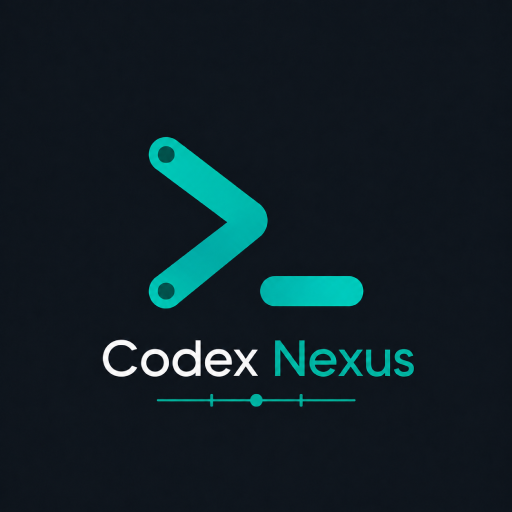

# Codex Nexus

<div align="center">



### Next-Generation AI Studio, Multi-Provider Orchestration & Bidirectional Typography for VS Code

[](package.json)
[](https://marketplace.visualstudio.com/items?itemName=amirimatin.codex-nexus)
[](LICENSE.md)
[](package.json)

</div>

---

## 📖 Overview

**Codex Nexus** is an all-in-one productivity suite for Visual Studio Code and OpenAI Codex. It bridges multi-provider AI endpoint management, unified model selection, smart streaming bidirectional (RTL/LTR) typography, and native VS Code AI Chat enhancement into a single, polished Google Material Design 3 interface.

Whether you are connecting to custom local LLMs (Ollama, vLLM, OpenWebUI, LiteLLM), switching between enterprise AI routers, or working with Arabic and Persian text alongside code, **Codex Nexus** delivers seamless usability without sacrificing performance or code integrity.

---

## 🌟 Key Features

### ⚡ 1. Multi-Provider AI Management (`config.toml`)
- **Direct Configuration**: View, add, edit, delete, and switch custom AI providers directly within the dashboard.
- **Native `~/.codex/config.toml` Integration**: Fully compatible with the official Codex configuration structure.
- **1-Click Switching**: Instantly toggle between custom providers and the official OpenAI system default.
- **Flexible Authentication**: Supports both environment variable references (`env_key = "MY_TOKEN"`) and direct API tokens (`sk-...`, `Bearer ...`).

### 🔍 2. Unified Model Combobox
- **Real-Time Live Search**: Search and filter available models with instant fuzzy matching.
- **Freeform Editing**: Select a model from the list or type custom/fine-tuned model names freely.
- **Automatic Discovery**: Automatically queries the active provider's `/v1/models` endpoint with manual refresh support.

### 🌐 3. Intelligent Streaming Bidirectional RTL (Arabic & Persian)
- **Zero-Flicker Streaming RTL**: Detects Persian/Arabic script dynamically during real-time streaming and aligns text paragraphs without delays.
- **LTR Code & Terminal Guard**: Keeps all code blocks (`pre`, `code`), Git diffs, interactive editor windows, and terminal surfaces strictly Left-to-Right with monospace typography.
- **Curated Font Typography**: Built-in support for **Vazirmatn**, **Noto Sans Arabic**, **Noto Sans Arabic UI**, **Estedad**, **IRANYekan**, **Sahel**, **Shabnam**, **Samim**, **Tanha**, and custom local font families.

### 💬 4. VS Code AI Chat & Copilot Workbench Integration
- **Full IDE AI Chat Enhancement**: Injects optimized RTL and Persian/Arabic typography rules into the native VS Code Chat and Copilot sidebars.
- **Automated Checksum Verification**: Automatically updates `product.json` checksums to prevent *"Unsupported / Corrupted installation"* warnings.

### 🎨 5. Google Material Design 3 (M3) Multilingual Dashboard
- **Dynamic Theme Adaptation**: Fully inherits VS Code theme variables (`--vscode-*`), providing seamless contrast in Dark, Light, and High-Contrast themes.
- **Multilingual Support**: Switch dashboard language instantly between **English**, **Persian (فارسی)**, and **Arabic (العربية)** with automatic layout direction flip.
- **Font Size & Preference Controls**: Easily adjust reading font size and typography preferences on the fly.

### 🔒 6. Zero-Conflict & Non-Invasive Architecture
- **Safe Isolation**: Does not disable, modify, or interfere with any other installed VS Code extension (e.g., GitHub Copilot, GitLens).
- **Clean Uninstallation & Recovery**: One-click restore command removes all managed patches and restores original backups safely.

---

## 🚀 Getting Started & Installation

### Method 1: VS Code Marketplace (Recommended)
1. Open VS Code.
2. Press `Ctrl+P` (or `Cmd+P` on macOS) and run:
   ```text
   ext install amirimatin.codex-nexus
   ```
3. Or search for **`Codex Nexus`** in the Extensions view (`Ctrl+Shift+X`).

---

### Method 2: Offline Automated Installer (Linux / macOS)
1. Clone or download the repository:
   ```bash
   git clone https://github.com/amirimatin/codex-nexus.git
   cd codex-nexus
   ```
2. Run the automated offline installer:
   ```bash
   ./installer.sh
   ```
   *The installer safely stops VS Code, builds the package, applies offline webview patches, and reopens VS Code automatically.*

---

## ⚙️ Custom Provider Configuration Example

Codex Nexus manages standard provider tables in `~/.codex/config.toml`:

```toml
model = "gpt-5.5"
model_provider = "custom-router"

[model_providers.custom-router]
name = "Enterprise AI Gateway"
base_url = "https://ai.example.com/v1"
env_key = "MY_AI_API_TOKEN"
wire_api = "responses"
```

You can create, edit, and switch active providers anytime through the **Manage Providers** drawer in the dashboard.

---

## ⌨️ Commands Reference

Access via Command Palette (`Ctrl+Shift+P` / `Cmd+Shift+P`):

| Command | Description |
| :--- | :--- |
| **`Codex Nexus: Apply Persian/Arabic RTL Patch`** | Applies smart RTL and typography patch to Codex webview and VS Code AI Chat |
| **`Codex Nexus: Check Compatibility`** | Verifies installation health, file integrity, and structural signals |
| **`Codex Nexus: Restore Original Files`** | Restores original backups and removes all managed patches |
| **`Codex Nexus: Full Cleanup and Reset Managed Settings`** | Performs complete cleanup and resets managed settings |
| **`Codex Nexus: Set Codex Language to Persian / Arabic / English`** | Instantly configures the active Codex UI language |
| **`Codex Nexus: Refresh Dashboard`** | Reloads dashboard state and queries live models from active provider |
| **`Codex Nexus: Open Logs`** | Opens the dedicated `Codex Nexus` output channel |

---

## 🔧 Extension Settings

| Setting | Default | Description |
| :--- | :--- | :--- |
| `codexNexus.enabled` | `true` | Enables Persian/Arabic font and RTL bidirectional engine. |
| `codexNexus.patchOnStartup` | `true` | Automatically verifies and applies patch on VS Code startup. |
| `codexNexus.dashboardLanguage` | `"en"` | UI language for the dashboard (`"fa"`, `"ar"`, or `"en"`). |
| `codexNexus.preferredFontFamily`| `"Vazirmatn"` | Preferred font family for AI conversation typography. |
| `codexNexus.fontSize` | `0` | Font size in pixels (`0` uses default size; values 10-24 supported). |
| `codexNexus.patchAiChat` | `true` | Applies RTL and font rules to VS Code AI Chat / Copilot surfaces. |

---

## 📄 License & Credits

- **Core Code**: Released under the [MIT License](LICENSE.md).
- **Fonts**: Bundled fonts are licensed under the [SIL Open Font License (OFL)](OFL.txt). See [THIRD_PARTY_NOTICES.md](THIRD_PARTY_NOTICES.md) for upstream attribution.
- Developed with ❤️ by **[Amiri Matin](https://github.com/amirimatin)**.
